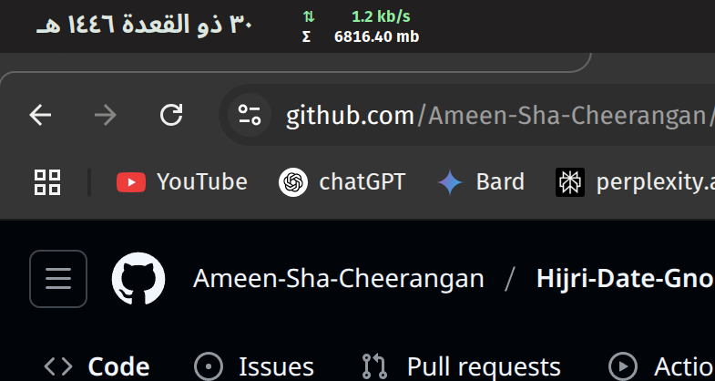

---

# Hijri-Date-Gnome-Extension
[](https://extensions.gnome.org/extension/5995/hijri-date-extension/)

> 📦 **Officially published on [extensions.gnome.org](https://extensions.gnome.org/extension/5995/hijri-date-extension/)!**
>
> For the easiest installation and updates, use the official GNOME Extensions website.

Display the Hijri date in the GNOME top panel.


> **Note:**  
> The Hijri date may differ by one or more days depending on local moon sightings. This extension uses a standard algorithm and provides an option to adjust the date for your region. **Do not use for important things.**

---

## Description

Hijri Date Extension is a GNOME Shell extension that displays the current Hijri date in the top panel of the GNOME Shell, with options to adjust the date and customize its appearance.

---

## Features

- **Displays the current Hijri date** in the GNOME top panel.
- **User-adjustable date offset** to match local moon sighting (±3 days).
- **Color customization**: Pick your preferred date color using a color picker.
- **Automatic daily update** based on system time.
- **Easy configuration** through a graphical preferences dialog.

---

## Installation


### **A. Install via GNOME Extensions Website**

   #### Prerequisites
   - Search in internet for understanding how to use gnome extension for you distro with gnome extension. 
   - Make sure that the extension is supported( You can check the metadata.json) for the gnome shell version that are supported
   - To know your gnome shell version you can type ```gnome-shell --version``` , 
      - If the metadata.json lists support for 4x (e.g., 42), then all versions like 4x.y (e.g., 42.9) are also supported.
1. Visit [Hijri Date Extension on extensions.gnome.org](https://extensions.gnome.org/extension/5995/hijri-date-extension/) 
2. Click the toggle to install.
3. Approve the installation in your browser and GNOME Shell.
4. The extension will appear in your top panel automatically.

### **B. Manual Installation from GitHub**

1. Download or clone this repository:
   ```sh
   git clone https://github.com/Ameen-Sha-Cheerangan/Hijri-Date-Gnome-Extension.git
   ```
2. Copy the extension folder to your local GNOME extensions directory:
   ```sh
   cp -r Hijri-Date-Gnome-Extension/my-hijri-date-extension@ameen-sha ~/.local/share/gnome-shell/extensions/
   ```
3. Restart GNOME Shell:
   - On Xorg: Press `Alt+F2`, type `r`, and press Enter.
   - On Wayland: Log out and log back in.
44. Enable the extension:
   ```sh
   gnome-extensions enable my-hijri-date-extension@ameen-sha
   ```
5. Restart GNOME Shell:
   - On Xorg: Press `Alt+F2`, type `r`, and press Enter.
   - On Wayland: Log out and log back in.

---

## Usage & Features

### **1. Adjusting the Hijri Date for Local Moon Sighting**

- Click on the date view in top panel , to see the drop down menu to go to the settings. OR  Right-click the extension in the Extensions app and select the **gear icon** (Preferences), or run:
  ```  sh  gnome-extensions prefs my-hijri-date-extension@ameen-sha  ```
- In the preferences dialog, use the **"Hijri Date Adjustment (days)"** spin button to shift the date forward or backward (e.g., +1 or -1) to match your local moon sighting.

### **2. Customizing the Date Color**

- In the same preferences dialog, use the **color picker** to choose your preferred color for the date display in the top panel.
- The date color will update instantly.

### **3. Automatic Updates**

- The extension updates the Hijri date automatically based on your system time.
- No manual refresh is needed.

---

## Contributing

Contributions are welcome!  
If you have suggestions, improvements, or bug fixes, please [open an issue](https://github.com/Ameen-Sha-Cheerangan/Hijri-Date-Gnome-Extension/issues) or submit a pull request.

---

## Credits

Thanks to the developer for : https://github.com/mourner/suncalc . Used it for calculating the sunset time given the longitude and latitude.

---

## ⭐ Support

If you like this extension, please star the repo on [GitHub](https://github.com/Ameen-Sha-Cheerangan/Hijri-Date-Gnome-Extension)!  
It helps more users find it and motivates further improvements.

---

## License

This project is licensed under the [MIT License](LICENSE).

---
